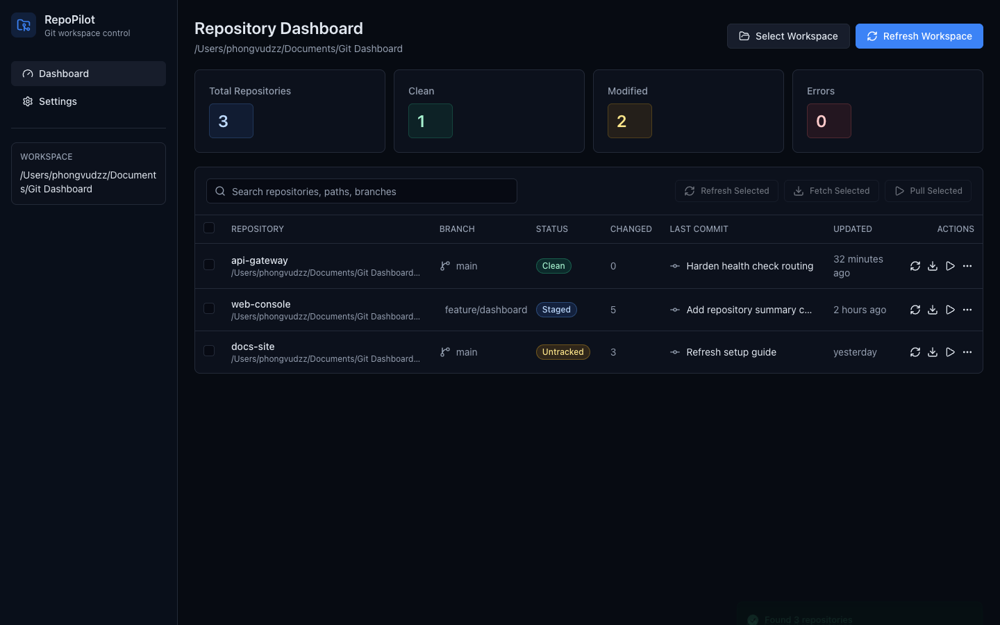

# RepoPilot

RepoPilot is a Tauri v2 desktop app for scanning local workspaces, monitoring many Git repositories at once, and running common Git actions from a focused dashboard.



## What This App Does

- Scans a selected workspace folder and detects nested Git repositories.
- Skips heavy generated folders such as `node_modules`, `dist`, `build`, `.next`, `.cache`, `target`, and `vendor`.
- Shows branch, working tree status, ahead/behind sync state, changed file counts, last commit, and remote URL.
- Supports refresh, fetch, pull, push, open in VS Code, and open in Terminal.
- Supports bulk refresh, fetch, and pull for selected repositories.
- Stores workspace, repository list, filters, search, settings, and selection in local Zustand state.
- Stores recent action history in local SQLite through the Tauri backend.
- Includes a command palette with `Cmd+K` on macOS or `Ctrl+K` on Windows/Linux.

## Important Deployment Note

RepoPilot is primarily a desktop app. The Tauri backend is required for native features:

- scanning real local folders
- running Git CLI commands
- writing SQLite activity history through Rust
- opening VS Code or Terminal

Vercel can deploy only the Vite/React frontend preview. On Vercel, the app runs in browser fallback mode with sample data and cannot access the visitor's filesystem or native Git commands.

Use Vercel for visual review only. Use `pnpm tauri dev` or the packaged `.app` for real RepoPilot behavior.

## Tech Stack

- Tauri v2
- React
- TypeScript
- Vite
- Tailwind CSS
- shadcn-style local UI primitives
- Zustand
- Sonner
- Lucide React
- Rust
- SQLite via `rusqlite`
- Vitest

## Prerequisites

Install these before running the project locally:

1. Node.js 24 or newer
2. pnpm 10 or newer
3. Rust stable with `cargo`
4. Git
5. Xcode Command Line Tools on macOS

Check your machine:

```bash
node --version
pnpm --version
rustc --version
cargo --version
git --version
```

If Rust is missing:

```bash
curl --proto '=https' --tlsv1.2 -sSf https://sh.rustup.rs | sh
source "$HOME/.cargo/env"
rustc --version
cargo --version
```

## Local Setup

From the project root:

```bash
cd "/Users/phongvudzz/Documents/Git Dashboard"
pnpm install
```

## Run Locally as a Desktop App

This is the main way to test RepoPilot:

```bash
pnpm tauri dev
```

Then test this flow:

1. Click `Select Workspace`.
2. Choose a folder that contains one or more Git repositories.
3. Confirm repositories appear in the dashboard table.
4. Use search by repository name, path, branch, or remote URL.
5. Try filters: `All`, `Clean`, `Modified`, `Ahead`, `Behind`, `Error`.
6. Select one or more repositories.
7. Run `Refresh Selected`, `Fetch Selected`, or `Pull Selected`.
8. Open a row menu and test `View Details`, `Refresh`, `Fetch`, `Pull`, `Push`, `Open in VS Code`, and `Open in Terminal`.
9. Press `Cmd+K` or `Ctrl+K` and test the command palette.
10. Confirm recent actions appear in the activity panel.

## Run Locally as a Browser Preview

This mode is useful for UI checks only. It uses browser fallback behavior and sample repositories.

```bash
pnpm dev
```

Open:

```txt
http://127.0.0.1:1420/
```

Browser preview limitations:

- It cannot scan real local folders.
- It cannot run real Git commands.
- It cannot open local VS Code or Terminal through Tauri.
- It cannot use the native SQLite backend.

## Test Locally

Run all standard checks from the project root:

```bash
pnpm test
pnpm lint
pnpm build
cd src-tauri
cargo test
cd ..
pnpm tauri build
```

Expected successful output:

- `pnpm test`: all Vitest tests pass
- `pnpm lint`: no ESLint errors
- `pnpm build`: Vite production build succeeds
- `cargo test`: Rust tests pass
- `pnpm tauri build`: macOS app and DMG are created

Build artifacts:

```txt
src-tauri/target/release/bundle/macos/RepoPilot.app
src-tauri/target/release/bundle/dmg/RepoPilot_0.2.0_aarch64.dmg
```

## GitHub Push Steps

If this folder is not already a Git repository:

```bash
cd "/Users/phongvudzz/Documents/Git Dashboard"
git init
git branch -M main
git add .
git commit -m "Build RepoPilot v0.2"
```

Create a GitHub repository, then connect it:

```bash
gh auth login
gh repo create repopilot --private --source=. --remote=origin --push
```

If you already created the repository on GitHub:

```bash
git remote add origin git@github.com:<your-github-username>/repopilot.git
git push -u origin main
```

Replace `<your-github-username>` with your GitHub username.

## Vercel Deployment Steps

Vercel deploys the browser preview only.

Install or run the Vercel CLI:

```bash
pnpm dlx vercel@latest login
```

Deploy a preview:

```bash
pnpm dlx vercel@latest
```

Deploy production:

```bash
pnpm dlx vercel@latest --prod
```

Recommended Vercel settings:

```txt
Framework Preset: Vite
Install Command: pnpm install --frozen-lockfile
Build Command: pnpm build
Output Directory: dist
```

These settings are also stored in `vercel.json`.

## Vercel Git Integration

After GitHub is connected to Vercel:

1. Open the Vercel dashboard.
2. Import the GitHub repository.
3. Select `Vite` as the framework.
4. Keep the build settings from `vercel.json`.
5. Deploy.
6. Every push to `main` creates a production deployment if your Vercel project is configured that way.
7. Pull requests and non-production branches create preview deployments.

## Project Structure

```txt
.
├── docs/
│   └── superpowers/plans/
├── public/
├── src/
│   ├── app/
│   ├── components/
│   ├── features/
│   ├── lib/
│   ├── stores/
│   └── types/
├── src-tauri/
│   └── src/
│       ├── commands.rs
│       ├── database.rs
│       ├── git.rs
│       ├── lib.rs
│       ├── models.rs
│       └── scanner.rs
├── package.json
├── pnpm-lock.yaml
├── vercel.json
└── vite.config.ts
```

## Native Command Surface

The Tauri backend exposes:

- `scan_workspace(path)`
- `refresh_repository(repoPath)`
- `refresh_repositories(repoPaths)`
- `fetch_repository(repoPath)`
- `pull_repository(repoPath)`
- `push_repository(repoPath)`
- `open_in_vscode(repoPath, command)`
- `open_in_terminal(repoPath, command)`
- `get_recent_activity(limit)`
- `record_activity(input)`
- `clear_recent_activity()`

## Troubleshooting

If `pnpm tauri dev` fails because Rust is missing:

```bash
source "$HOME/.cargo/env"
rustup update
```

If the app opens but no repositories appear:

1. Make sure the selected workspace contains folders with `.git`.
2. Make sure those repositories are not inside ignored folders such as `node_modules`, `dist`, `build`, `.next`, `.cache`, `target`, or `vendor`.
3. Try selecting a smaller workspace folder first.

If Git actions fail:

1. Confirm Git is installed with `git --version`.
2. Open the repository in Terminal.
3. Run `git status`.
4. Run the failing command manually, for example `git fetch` or `git pull`.
5. Fix auth, conflict, or upstream issues in Git, then retry in RepoPilot.

If Vercel deploy works but native features do not:

That is expected. Vercel is browser-only for this project. Run `pnpm tauri dev` for native features.
# git-dashboard
